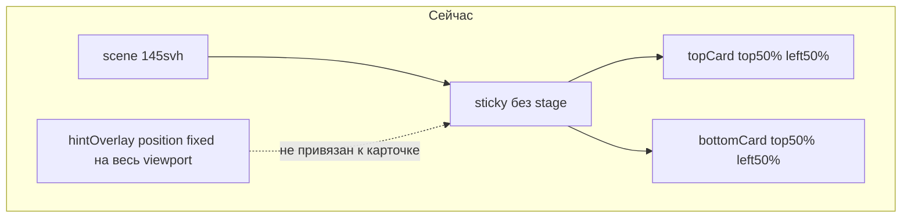
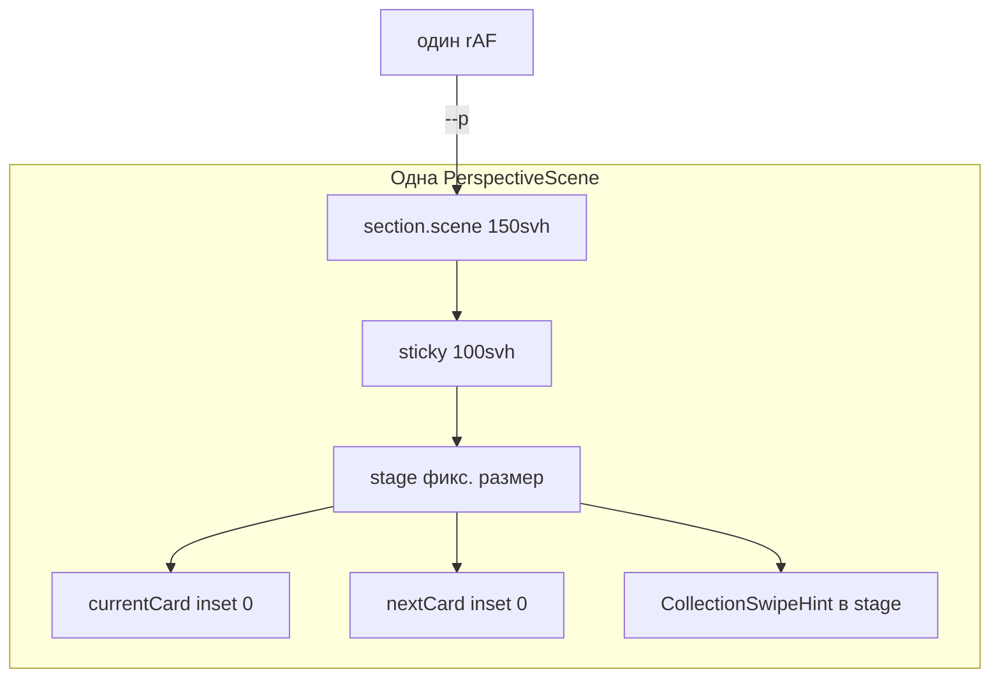

# Переписать PerspectiveSectionTransition (сценовая модель)

## Диагноз текущих поломок



- Карточки [`.topCard`/`.bottomCard`](components/sections/PerspectiveSectionTransition/perspective-section-transition.module.css) центрируются через `top: 50%; left: 50%` **без общего clipping-box** — при скролле нескольких сцен одновременно видны фрагменты 3–4 карточек.
- [`hintOverlay`](components/sections/PerspectiveSectionTransition/PerspectiveSectionTransition.tsx) (`position: fixed; inset: 0`) — hint не привязан к активной карточке.
- Sticky с `top: calc(safe-area + 88px)` и разной высотой на desktop/mobile расходится со спецификацией и даёт «чёрные провалы».

LarosePair уже удалён; framer-motion в папке не используется. Задача — **переписать DOM/CSS/привязку hint**, а не точечные патчи.

---

## Целевая модель



- Сцены идут **вертикально друг за другом** (scroll track).
- Внутри сцены **только `stage`** задаёт размер; обе карточки `position: absolute; inset: 0` — **вне обычного потока**.
- Анимация только `transform` + `opacity` через `--p` на `.scene`.

---

## 1. Переписать CSS с нуля

**Файл:** [`perspective-section-transition.module.css`](components/sections/PerspectiveSectionTransition/perspective-section-transition.module.css)

**Удалить:** `.hintOverlay`, `.topCard`, `.bottomCard`, `--nav-offset`, sticky с offset 88px, `@media` reduced-motion для `.topCard` (fallback только в React).

**Заменить на спецификацию пользователя** (дословно по смыслу):

| Класс | Назначение |
|-------|------------|
| `.wrapper` | `background #0b0d10`, `overflow-x: clip`, `touch-action: pan-y` |
| `.scene` | `--p: 0`, `height: 150svh` (mobile `135svh`) |
| `.sticky` | `sticky top: 0`, `height: 100svh`, flex center; mobile: `padding-top: safe-area + 72px`, `padding-bottom: 24px` |
| `.stage` | `position: relative`, фикс. `width`/`height`, `isolation: isolate` |
| `.card` | `absolute inset: 0`, GPU/contain, `border-radius` |
| `.currentCard` / `.nextCard` | transforms/opacity через `--p` (desktop + mobile блоки из ТЗ) |
| `.image` | `object-fit: cover` везде |
| `.swipeHintWrap` | `absolute` в stage: `bottom: clamp(18px, 5svh, 42px)`, `z-index: 10`, не влияет на layout |

**Static fallback** (`.staticSlide`): вертикальный список, те же размеры stage на mobile (`min(92vw, 420px)`), без sticky.

---

## 2. Переписать `PerspectiveScene.tsx`

**Файл:** [`PerspectiveScene.tsx`](components/sections/PerspectiveSectionTransition/PerspectiveScene.tsx)

DOM по ТЗ:

```tsx
<section ref={ref} className={styles.scene}>
  <div className={styles.sticky}>
    <div className={styles.stage}>
      <article className={`${styles.card} ${styles.currentCard}`}>…</article>
      <article className={`${styles.card} ${styles.nextCard}`}>…</article>
      {showHint ? (
        <CollectionSwipeHint
          activeSlug={activeSlug}
          slug={activeSlug}
          visible={sectionInView}
        />
      ) : null}
    </div>
  </div>
</section>
```

Props:

- `currentImage`, `nextImage`, alts, `priorityCurrent`
- `showHint: boolean` — только у доминантной сцены
- `activeSlug`, `sectionInView` — для hint

`forwardRef` на `<section>` (ref для progress).

---

## 3. Обновить `usePerspectiveScenesProgress.ts`

**Файл:** [`usePerspectiveScenesProgress.ts`](components/sections/PerspectiveSectionTransition/usePerspectiveScenesProgress.ts)

Изменения:

1. **Формула progress** (как в ТЗ):

```ts
const vh = window.visualViewport?.height ?? window.innerHeight;
const rect = scene.getBoundingClientRect();
const scrollable = rect.height - vh;
const progress = scrollable <= 0 ? 0 : clamp01(-rect.top / scrollable);
scene.style.setProperty("--p", String(progress));
```

2. **Порог slug:** `progress < 0.55` → `currentSlug`, иначе `nextSlug`.

3. **Колбэк расширить:** `onActiveChange({ slug, sceneIndex })` — вызывать только при изменении `slug` **или** `sceneIndex` (ref + сравнение, без setState в `calc`).

4. Оставить: один rAF gate, Lenis + `window` scroll/resize, отсев невидимых сцен (`rect.bottom < 0 || rect.top > vh`) перед `getBoundingClientRect`.

---

## 4. Переписать `PerspectiveSectionTransition.tsx`

**Файл:** [`PerspectiveSectionTransition.tsx`](components/sections/PerspectiveSectionTransition/PerspectiveSectionTransition.tsx)

- Убрать [`hintOverlay`](components/sections/PerspectiveSectionTransition/PerspectiveSectionTransition.tsx) целиком.
- State: `activeSlug`, `activeSceneIndex`, `sectionInView` (IntersectionObserver `threshold: 0.08` — без изменений).
- Рендер `collections.slice(0, -1)` → `PerspectiveScene` с:
  - `showHint={index === activeSceneIndex}`
  - `activeSlug`, `sectionInView`
  - images через `getCollectionCoverImage(col, isMobile)`
- Swipe на wrapper: `useSwipeRightNavigate` → `/collections/${activeSlug}`.
- Fallback: `collections.length < 2` **или** `prefers-reduced-motion` → `StaticFallback` (вертикальный список, один hint на слайд допустим для a11y).
- Убрать лишний `useSyncExternalStore` для mobile, если cover одинаковый на breakpoints — **оставить** для `getCollectionCoverImage`.

---

## 5. `CollectionSwipeHint.tsx`

**Минимально:** обновить только стили в module CSS (`.swipeHintWrap` под stage). Логика `activeSlug === slug` уже корректна — в сцене передаём `slug={activeSlug}`.

---

## 6. Что не трогаем

- [`useSwipeRightNavigate.ts`](components/sections/PerspectiveSectionTransition/useSwipeRightNavigate.ts)
- [`HighlightsCollections.tsx`](components/sections/HighlightsCollections.tsx)
- [`next.config.ts`](next.config.ts) `localPatterns` (уже настроены для `/HighlightsCollections/**`)

---

## Критерии приёмки (маппинг на ТЗ)

| # | Решение |
|---|---------|
| 1–3 | `stage` + `inset: 0` — одна видимая пара карточек на экран |
| 4 | `150svh`/`135svh` scroll track, sticky `100svh`, без overlap −100vh |
| 5 | Hint в `.stage` активной сцены, `showHint` по `activeSceneIndex` |
| 6–7 | rAF + `--p`, setState только на смену slug/index |
| 8–10 | Нет framer-motion, нет 200vh, `object-fit: cover` на mobile |

---

## Порядок работ

1. CSS — новая схема классов  
2. `PerspectiveScene` — DOM + props  
3. `usePerspectiveScenesProgress` — формула + `activeSceneIndex`  
4. `PerspectiveSectionTransition` — wiring, удалить overlay  
5. Ручная проверка: desktop + 375px, 3 коллекции, reduced-motion
